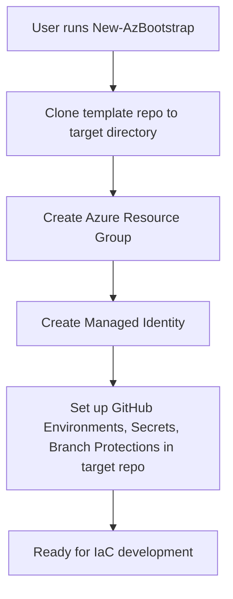

# az-bootstrap Design

## Overview

`az-bootstrap` is a PowerShell module designed to automate the setup of Azure and GitHub environments for Infrastructure-as-Code (IaC) projects. It is inspired by the experience of using `azd up`, but is focused on bootstrapping the foundational cloud and repository configuration for secure, automated deployments.

## Template/Target Repository Pattern

- **Source (Template) Repository:**
  - A GitHub repository (such as [terraform-azure-starter-template](https://github.com/kewalaka/terraform-azure-starter-template)) that serves as a starting point for new IaC projects.
  - This repository is cloned by the module to create a new solution repository.
- **Target (Solution) Repository:**
  - The new repository created from the template, where the DevOps engineer will build their solution.
  - The module configures this repository with GitHub environments, secrets, and branch protections.

## Key Features

- **Repo Cloning:** Clones a specified GitHub template repository to a local directory.
- **Azure Infra:** Creates a resource group and managed identity, and configures federated credentials for OIDC-based GitHub Actions workflows.
- **GitHub Environments:** Creates GitHub environments (PLAN, APPLY, etc.), sets secrets, and applies branch protection and deployment policies.
- **Extensible:** Designed to support both GitHub and Azure DevOps in the future.
- **RBAC Assignment:** Grants Contributor and User Access Administrator roles to the managed identity at the resource group level for full deployment and access control capabilities.

## Architecture

- **Public Interface:**
  - `New-AzBootstrap`: Orchestrates the full bootstrap process.
- **Private Functions:**
  - `Get-AzGitRepositoryInfo`, `Invoke-AzGhCommand`, `New-AzResourceGroup`, `New-AzManagedIdentity`, `New-AzFederatedCredential`, `New-AzGitHubEnvironment`, `Set-AzGitHubEnvironmentSecrets`, `Set-AzGitHubEnvironmentPolicy`, `New-AzGitHubBranchRuleset`, etc.
- **Separation of Concerns:**
  - Each function is responsible for a single task, making the module easy to maintain and extend.

## Flow Diagram



## Extensibility

- The module is structured to allow easy addition of new cloud providers, repo hosts, or environment policies.
- Private functions can be extended or replaced as requirements evolve.

## Security

- Uses OIDC federated credentials for secure, passwordless deployments from GitHub Actions.
- Secrets are set per-environment in GitHub for least-privilege access.

## Future Enhancements

- Support for Azure DevOps and other repo hosts
- More granular policy and RBAC configuration
- Interactive wrappers for user-friendly onboarding

## Testing with Pester

This module uses [Pester](https://pester.dev/) for unit and integration testing.

To run the tests:

- Open a PowerShell terminal.
- Navigate to the root directory of the `az-bootstrap` module.
- Run the following command:

```powershell
set-executionpolicy -scope process -executionpolicy bypass
Invoke-Pester -Path ./tests/
# or to exclude a specific test
Invoke-Pester -Path ./tests/ -ExcludePath "*NewAzBootstrap*"
```

This command will discover and execute all test files (`*.Tests.ps1`) within the `tests` directory.

---

For usage instructions, see [README.md](./README.md).
