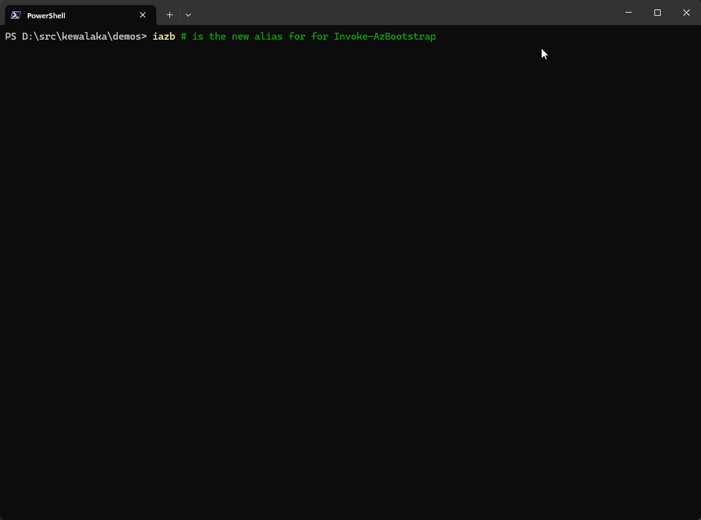
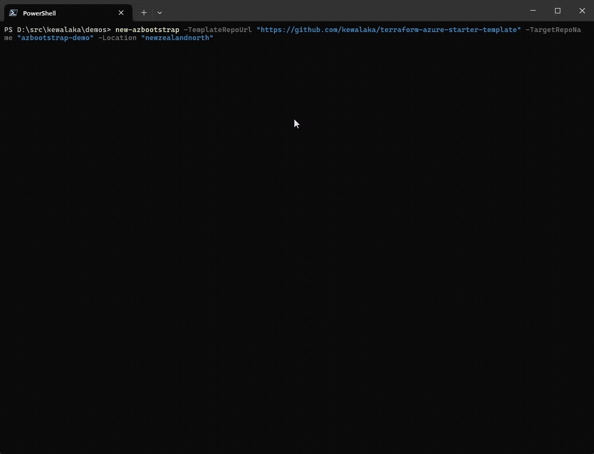
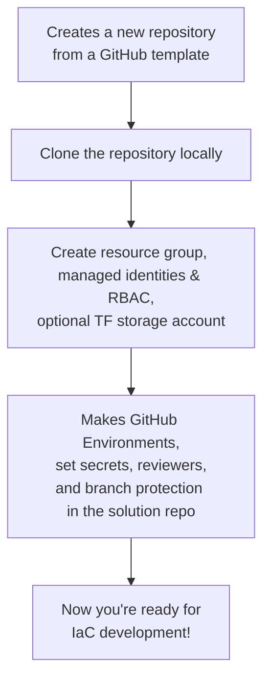

# az-bootstrap

A PowerShell module to bootstrap Azure and GitHub components for Infrastructure-as-Code (IaC) projects.  As debuted at 🌏Global Azure 2025🎉

`az-bootstrap` 💖 `azd`.

Azure Bootstrap augments [Azure Developer CLI](https://learn.microsoft.com/en-us/azure/developer/azure-developer-cli/overview?tabs=windows&WT.mc_id=MVP_388586) (azd),
adding support for managed identities (via OIDC), and the creation of GitHub environments with secrets, a default branch ruleset, and reviewers.

You can use it to bootstrap demos, or as a lightweight alternative to subscription vending.  `az-bootstrap` makes it easier to create solution-scoped deployment identities, and just means less clicking.

## Interactive mode

Use `Invoke-AzBootstrap` (or the alias, `iazb`) without inputs for interactive mode:



## Non-interactive mode

You can alternatively supply parameters in which case it runs non-interactively



Please note: as of v0.5 `-SkipConfirmation $true` needs to be added to the parameters to bypass the prompt.

## What does it do?



## Get started

To get you started you need:

1. PowerShell 7, Az CLI, and the GitHub CLI installed
1. You must be logged in to both **Az CLI** and **GitHub CLI** before running the module.
1. Azure permissions (Contributor, RBAC Admin), and permission to create GitHub repositories

## Usage Examples

### Interactive Mode

For guided setup with sensible defaults, simply run without any parameters:

```pwsh
Invoke-AzBootstrap
```

This will prompt you for required information with default values provided:

- Template Repository URL (default: `kewalaka/terraform-azure-starter-template`)
- Target Repository Name (required)
- Azure Location (default: `australiaeast`)
- Resource Group Name (default: `rg-{repo-name}-{initial-environment-name}`)
- Plan Managed Identity Name (default: `mi-{repo-name}-{initial-environment-name}-plan`)
- Apply Managed Identity Name (default: `mi-{repo-name}-{initial-environment-name}-apply`)
- Terraform State Storage Account Name (default: `st{repo-name}{initial-environment-name}{padding}`, truncated if needed)

After entering all inputs, you'll see a configuration summary and be prompted to confirm before proceeding.

### Minimal example

```powershell
Install-Module Az-Bootstrap -Scope CurrentUser

$params = @{
  TemplateRepoUrl     = "https://github.com/kewalaka/terraform-azure-starter-template"
  # Or use GitHub shorthand: "kewalaka/terraform-azure-starter-template"
  # Or use an alias (if configured): "terraform"
  TargetRepoName      = "my-new-demo"
  Location            = "newzealandnorth"
}
Invoke-AzBootstrap @params
```

The above will:

- Clones the repository specified by `TemplateRepoUrl` into a new repository specified by `TargetRepoName`
- Creates an Azure resource group and two managed identities (default naming: 'rg-#reponame-dev-plan' and 'rg-#reponame-dev-apply'
- Grants Reader to the plan identity and Contributor + RBAC Administrator (RBAC) roles to the apply managed identity at the resource group level
- Sets up federated credentials for GitHub environments (defautl naming: "dev-iac-plan" and "dev-iac-apply")
- Configures GitHub environments, secrets, and branch protection in the new target repository.
- Creates a `.azbootstrap.jsonc` file in the target repository to track created resources
- v0.4 - Creates an optional storage account for Terraform state, assigning both identities `Storage Blob Data Contributor`.

Naming conventions can be overriden to suit, for example, to include a location in the RG and MI name, you could do this:

```powershell
$name = "my-new-demo"
$params = @{
  TemplateRepoUrl          = "https://github.com/kewalaka/terraform-azure-starter-template"
  TargetRepoName           = "$name"
  ResourceGroupName        = "rg-$name-dev-nzn-01"
  PlanManagedIdentityName  = "mi-$name-dev-nzn-01-plan"
  ApplyManagedIdentityName = "mi-$name-dev-nzn-01-plan" \
  Location                 = "newzealandnorth"
  # if you want to have a pre-made Terraform state file, complete with a bit of randomness for good luck:
  TerraformStateStorageAccountName = "st{0}devnzn{1}" -f $name.replace("-",""), $([System.Guid]::NewGuid().ToString('N').Substring(0,4))
}
Invoke-AzBootstrap @params
```

### Add and remove additional environments

The above will set up for a `dev` environment by default (name set by `InitialEnvironmentName`).

You can add or remove environments using:

```pwsh
# Add a new environment (e.g., 'test')
Add-AzBootstrapEnvironment -EnvironmentName "test" -ResourceGroupName "rg-my-new-demo-test-nzn" -Location "newzealandnorth"
```

Adding an environment will:

- Create a new Azure resource group and managed identities for the environment (if they do not already exist)
- Assign Reader for the plan identity and Contributor + RBAC Administrator roles to the apply managed identity at the resource group level
- Set up federated credentials for GitHub OIDC trust for this environment
- Create two GitHub environments (e.g., "test-iac-plan" and "test-iac-apply") in the target repository
- Set required GitHub environment secrets (Azure tenant, subscription, client ID)
- Optionally configure deployment reviewers and branch protection for the environment
- Update the `.azbootstrap.jsonc` file with details about the new environment

### Complete Example

```powershell
# Example showing all the parameters
$name = "fancy-demo-project"
$environment = "dev"
$params = @{
  # required
  TemplateRepoUrl                = "https://github.com/kewalaka/terraform-azure-starter-template"
  TargetRepoName                 = $name
  ResourceGroupName              = "rg-$name-$environment-nzn"
  PlanManagedIdentityName        = "mi-$name-$environment-nzn-plan"
  ApplyManagedIdentityName       = "mi-$name-$environment-nzn-apply"
  Location                       = "newzealandnorth"

  # optional

  # Suffix for the "plan" GitHub environment (default: "dev-iac-plan")
  PlanEnvName = "$environment-iac-plan"
  
  # Suffix for the "apply" GitHub environment (default: "dev-iac-apply")
  ApplyEnvName = "$environment-iac-apply"
  
  # Where to clone repo locally (default: ".\$TargetRepoName")
  TargetDirectory = "D:\src\kewalaka\demos\$name" 
  
  # Terraform State Storage account
  TerraformStateStorageAccount = "strasndn23914"
  
  # "private" or "public" (default: "public")
  Visibility = "private"             
  
  # GitHub org/user for the new repo (default: detected from gh auth)
  Owner = "my-org-or-user"      

  # Azure tenant ID (default: from environment variable)
  ArmTenantId = $env:ARM_TENANT_ID    

  # Azure subscription ID (default: from environment variable)
  ArmSubscriptionId = $env:ARM_SUBSCRIPTION_ID 

  # Branch to protect (default: "main")
  ProtectedBranchName = "main"                

  # Number of required PR reviewers (default: 1)
  RequiredReviewers = 1                     

  # Dismiss stale PR reviews on new commits (default: $true)
  BranchDismissStaleReviews = $true

  # Require code owner review (default: $false)
  BranchRequireCodeOwnerReview = $false

  # Require approval after last push (default: $false)
  BranchRequireLastPushApproval = $false

  # Require all threads resolved before merging (default: $false)
  BranchRequireThreadResolution = $false

  # Allowed merge methods (default: @("squash"))
  BranchAllowedMergeMethods = @("squash", "merge", "rebase")

  # Enable Copilot code review (default: $true)
  BranchEnableCopilotReview = $true                 

  # Name for the initial environment (default: "dev")
  InitialEnvironmentName = $environment          

  # GitHub users/teams required to approve deployments to apply environment
  ApplyEnvironmentUserReviewers = @("reviewer1", "reviewer2")

  # Add the owner of the repo (as determined elsewhere) as a reviewer.
  AddOwnerAsReviewer = $true
}

# Initial bootstrap
Invoke-AzBootstrap @params

# Add a new environment (e.g., 'test')
Add-AzBootstrapEnvironment `
    -EnvironmentName "test" `
    -ResourceGroupName "rg-$name-$environment-nzn" `
    -Location "australiaeast" `
    -PlanManagedIdentityName "mi-$name-$environment-nzn-plan" `
    -ApplyManagedIdentityName "mi-$name-$environment-nzn-apply" `
    -Owner "my-org-or-user" `
    -Repo "$name" `
    -PlanEnvName "$environment-iac-plan" `
    -ApplyEnvName "$environment-iac-apply" `
    -ArmTenantId $env:ARM_TENANT_ID `
    -ArmSubscriptionId $env:ARM_SUBSCRIPTION_ID `
    -ApplyEnvironmentUserReviewers @("reviewer1", "reviewer2")
```

The above demonstrates how to:

- Bootstrap a new project with initial environments.
- Add additional environments as needed.

## Global Settings File

You can optionally create a global settings file at `~/.azbootstrap-globals.jsonc` to store template repository aliases and other preferences. This allows you to use short aliases instead of full repository URLs.

### Example Configuration

Create a file at `~/.azbootstrap-globals.jsonc` with the following content:

```jsonc
{
    // Template repository aliases for commonly used templates
    "templateAliases": {
        "terraform": "https://github.com/kewalaka/terraform-azure-starter-template",
        "bicep": "https://github.com/kewalaka/bicep-azure-starter-template",
        "my-org-template": "https://github.com/my-org/starter-template"
    },
    
    // Default Azure location to use when not specified
    "defaultLocation": "newzealandnorth"
}
```

### Using Template Aliases

Once configured, you can use the aliases in place of full URLs:

```powershell
# Using an alias instead of the full URL
$params = @{
  TemplateRepoUrl     = "terraform"  # Resolves to the URL defined in the config
  TargetRepoName      = "my-new-demo"
  # Location can be omitted if defaultLocation is set in the config file
}
Invoke-AzBootstrap @params
```

### Template URL Resolution

The module resolves template repository URLs in the following order:

1. **Full URLs** - If you provide a full `https://` URL, it's used as-is
2. **Configured aliases** - If the value matches an alias in your global config, it's resolved to the configured URL
3. **GitHub shorthand** - If the value matches the pattern `owner/repo`, it's expanded to `https://github.com/owner/repo`
4. **As-is** - If none of the above match, the value is passed through unchanged

The global settings file is completely optional - the module works without it using full URLs or GitHub shorthand notation.

## Next Steps

- See [DESIGN.md](./DESIGN.md) for more details on architecture and extensibility.

## Roadmap

In no particular order, and without any commitments:

- Create an interactive wrapper as part of my [starter template](https://github.com/kewalaka/terraform-azure-starter-template) to help people with a guided approach. (Done in 0.5 ✅)
- Global settings file (~/.az-bootstrap.jsonc) with template repository aliases (Done in 0.5 ✅)
- Examples targeting Bicep (the general approach, as is, will work good with Bicep too!)
- Support for Azure DevOps
