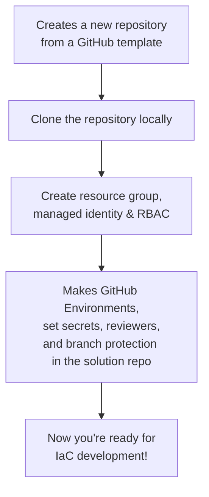

# az-bootstrap

A PowerShell module to bootstrap Azure infrastructure and GitHub repository environments for Infrastructure-as-Code (IaC) projects.

It is designed as a lightweight alternative to subscription vending, suitable for smaller projects and settings up demos.

## What does it do?



## Get started

To get you started you need:

1. PowerShell 7, Az CLI, and the GitHub CLI installed
1. You must be logged in to both Azure and GitHub CLIs before running the module.
1. Azure permissions (Contributor, RBAC Admin), and permission to create GitHub repositories

## Usage Example

```powershell
Install-Module Az-Bootstrap -Scope CurrentUser

# Example assuming you want the new repo 'my-new-iac-project' created under your user account
$params = {
  TemplateRepoUrl     = "https://github.com/kewalaka/terraform-azure-starter-template"
  TargetRepoName      = "my-new-iac-project"
  PlanEnvName         = "plan"
  ApplyEnvName        = "apply"
  ResourceGroupName   = "rg-my-new-iac-project"
  ManagedIdentityName = "mi-my-new-iac-project" 
  Location            = "newzealandnorth"
  # optionally omit these and specify using $env:ARM_TENANT_ID and $env:ARM_SUBSCRIPTION_ID
  ArmTenantID         = "2c7d1c9d-1ee9-4be3-924a-d4c3466fa22a"
  ArmSubscriptionID   = "faf579e7-385d-47cd-8990-a6789973ce5f"
}
New-AzBootstrap @params
```

The above will:

- Clones a starter template repository from GitHub (the "source" template repo) into a "target" repository.
- Creates an Azure resource group and managed identity
- Grants Contributor and RBAC Administrator (RBAC) roles to the managed identity at the resource group level
- Sets up federated credentials for GitHub environments
- Configures GitHub environments, secrets, and branch protection in the new ("target") repository.

## Updated Usage Example

```powershell
# Example for creating a new project with multiple environments
$params = {
  TemplateRepoUrl     = "https://github.com/kewalaka/terraform-azure-starter-template"
  TargetRepoName      = "my-new-iac-project"
  PlanEnvName         = "plan"
  ApplyEnvName        = "apply"
  ResourceGroupName   = "rg-my-new-iac-project"
  ManagedIdentityName = "mi-my-new-iac-project"
  Location            = "newzealandnorth"
}

# Initial bootstrap
New-AzBootstrap @params

# Add a new environment (e.g., 'test')
Add-Environment -EnvironmentName "test" -ResourceGroupName "rg-my-new-iac-project-test" -Location "australiaeast"

# Remove an environment (e.g., 'test')
Remove-Environment -EnvironmentName "test" -ResourceGroupName "rg-my-new-iac-project-test"
```

The above demonstrates how to:

- Bootstrap a new project with initial environments.
- Add additional environments as needed.
- Remove environments when they are no longer required.

## Next Steps

- See [DESIGN.md](./DESIGN.md) for more details on architecture and extensibility.
