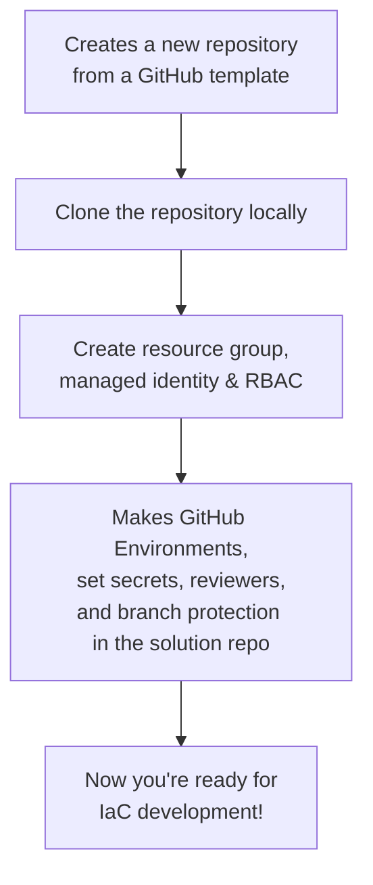

# az-bootstrap

A PowerShell module to bootstrap Azure infrastructure and GitHub repository environments for Infrastructure-as-Code (IaC) projects.

## What does it do?

This PS Module helps boostrap your Azure and GitHub environment:



## Get started

To get you started you need:

1. PowerShell 7, Az CLI, and the GitHub CLI installed
1. You must be logged in to both Azure and GitHub CLIs before running the module.
1. Azure permissions (Contributor, RBAC Admin), and permission to create GitHub repositories

## Usage Example

```powershell
Install-Module Az-Bootstrap -Scope CurrentUser

# Example assuming you want the new repo 'my-new-iac-project' created under your user account
$params = {
  TemplateRepoUrl     = "https://github.com/kewalaka/terraform-azure-starter-template"
  TargetRepoName      = "my-new-iac-project"
  PlanEnvName         = "plan"
  ApplyEnvName        = "apply"
  ResourceGroupName   = "rg-my-new-iac-project"
  ManagedIdentityName = "mi-my-new-iac-project" 
  Location            = "newzealandnorth" 
}
New-AzBootstrap @params
```

- The command above will clone the template repo, create the Azure infra, and configure the new solution repo for secure OIDC-based deployments.
- You need to provide Azure Tenant and Subscription IDs either via parameters (`-ArmTenantId`, `-ArmSubscriptionId`) or environment variables (`$env:ARM_TENANT_ID`, `$env:ARM_SUBSCRIPTION_ID`). The Managed Identity Client ID (`ARM_CLIENT_ID`) is automatically determined and configured.

## Next Steps

- See [DESIGN.md](./DESIGN.md) for more details on architecture and extensibility.
