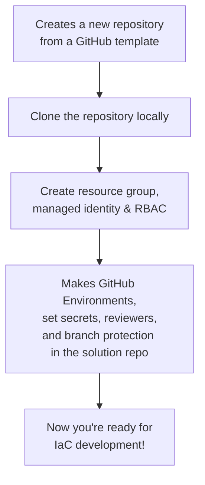

# az-bootstrap

A PowerShell module to bootstrap Azure infrastructure and GitHub repository environments for Infrastructure-as-Code (IaC) projects.

It is designed as a lightweight alternative to subscription vending, suitable for smaller projects and settings up demos.

## What does it do?



## Get started

To get you started you need:

1. PowerShell 7, Az CLI, and the GitHub CLI installed
1. You must be logged in to both **Az CLI** and **GitHub CLI** before running the module.
1. Azure permissions (Contributor, RBAC Admin), and permission to create GitHub repositories

## Usage Examples

### Minimal example

```powershell
Install-Module Az-Bootstrap -Scope CurrentUser

$env:ArmTenantID = "2c7d1c9d-1ee9-4be3-924a-d4c3466fa22a"
$env:ArmSubscriptionID = "faf579e7-385d-47cd-8990-a6789973ce5f"

# Example assuming you want the new repo 'my-new-iac-project' created under your user account
$params = {
  TemplateRepoUrl     = "https://github.com/kewalaka/terraform-azure-starter-template"
  TargetRepoName      = "my-new-iac-project"
  ResourceGroupName   = "rg-my-new-iac-project"
  ManagedIdentityName = "mi-my-new-iac-project" 
  Location            = "newzealandnorth"
}
New-AzBootstrap @params
```

The above will:

- Clones a starter template repository from GitHub (the "source" template repo) into a "target" repository.
- Creates an Azure resource group and managed identity
- Grants Contributor and RBAC Administrator (RBAC) roles to the managed identity at the resource group level
- Sets up federated credentials for GitHub environments ("dev_plan" and "dev_apply")
- Configures GitHub environments, secrets, and branch protection in the new ("target") repository.

### Add and remove additional environments

The above will set up for a `dev` environment by default (name set by `InitialEnvironmentName`).

You can add or remove environments using:

```pwsh
# Add a new environment (e.g., 'test')
Add-Environment -EnvironmentName "test" -ResourceGroupName "rg-my-new-iac-project-test" -Location "newzealandnorth"

# Remove an environment (e.g., 'test')
Remove-Environment -EnvironmentName "test" -ResourceGroupName "rg-my-new-iac-project-test"
```

Adding an environment will:

- Create a new Azure resource group and managed identity for the environment (if they do not already exist)
- Assign Contributor and RBAC Administrator roles to the managed identity at the resource group level
- Set up federated credentials for GitHub OIDC trust for this environment
- Create two GitHub environments (e.g., "test-plan" and "test-apply") in the target repository
- Set required GitHub environment secrets (Azure tenant, subscription, client ID)
- Optionally configure deployment reviewers and branch protection for the environment

### Complete Example

```powershell
# Example for creating a new project with multiple environments
$params = @{
  TemplateRepoUrl                = "https://github.com/kewalaka/terraform-azure-starter-template"
  TargetRepoName                 = "my-new-iac-project"
  PlanEnvName                    = "plan"                # (string, optional) Suffix for the "plan" GitHub environment (default: "plan")
  ApplyEnvName                   = "apply"               # (string, optional) Suffix for the "apply" GitHub environment (default: "apply")
  ResourceGroupName              = "rg-my-new-iac-project"
  ManagedIdentityName            = "mi-my-new-iac-project"
  Location                       = "newzealandnorth"
  TargetDirectory                = "D:\src\kewalaka\pwsh\my-new-iac-project" # (string, optional) Where to clone repo locally (default: ".\$TargetRepoName")
  Visibility                     = "private"             # (string, optional) "private" or "public" (default: "public")
  Owner                          = "my-org-or-user"      # (string, optional) GitHub org/user for the new repo (default: detected from gh auth)
  ArmTenantId                    = $env:ARM_TENANT_ID    # (string, optional) Azure tenant ID (default: from environment variable)
  ArmSubscriptionId              = $env:ARM_SUBSCRIPTION_ID # (string, optional) Azure subscription ID (default: from environment variable)
  ProtectedBranchName            = "main"                # (string, optional) Branch to protect (default: "main")
  RequiredReviewers              = 1                     # (int, optional) Number of required PR reviewers (default: 1)
  BranchDismissStaleReviews      = $true                 # (bool, optional) Dismiss stale PR reviews on new commits (default: $true)
  BranchRequireCodeOwnerReview   = $false                # (bool, optional) Require code owner review (default: $false)
  BranchRequireLastPushApproval  = $true                 # (bool, optional) Require approval after last push (default: $true)
  BranchRequireThreadResolution  = $false                # (bool, optional) Require all threads resolved before merging (default: $false)
  BranchAllowedMergeMethods      = @("squash")           # (string[], optional) Allowed merge methods (default: @("squash"))
  BranchEnableCopilotReview      = $true                 # (bool, optional) Enable Copilot code review (default: $true)
  InitialEnvironmentName         = "dev"                 # (string, optional) Name for the initial environment (default: "dev")
  ApplyEnvironmentReviewers      = @("reviewer1", "reviewer2") # (string[], optional) GitHub users/teams required to approve deployments to apply environment
}

# Initial bootstrap
New-AzBootstrap @params

# Add a new environment (e.g., 'test')
Add-Environment `
    -EnvironmentName "test" `
    -ResourceGroupName "rg-my-new-iac-project-test" `
    -Location "australiaeast" `
    -ManagedIdentityName "mi-my-new-iac-project-test" `
    -Owner "my-org-or-user" `
    -Repo "my-new-iac-project" `
    -PlanEnvName "plan" `
    -ApplyEnvName "apply" `
    -ArmTenantId $env:ARM_TENANT_ID `
    -ArmSubscriptionId $env:ARM_SUBSCRIPTION_ID `
    -ApplyEnvironmentReviewers @("reviewer1", "reviewer2")

# Remove an environment (e.g., 'test')
Remove-Environment -EnvironmentName "test" -ResourceGroupName "rg-my-new-iac-project-test"
```

The above demonstrates how to:

- Bootstrap a new project with initial environments.
- Add additional environments as needed.
- Remove environments when they are no longer required.

## Next Steps

- See [DESIGN.md](./DESIGN.md) for more details on architecture and extensibility.
