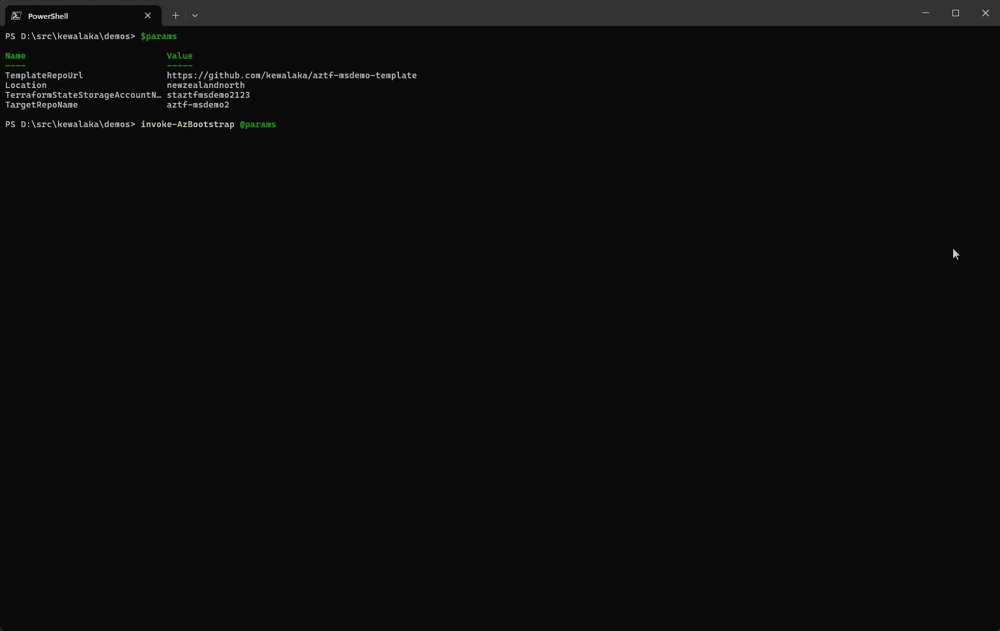

# az-bootstrap

A PowerShell module to bootstrap Azure and GitHub components for Infrastructure-as-Code (IaC) projects.  As debuted at 🌏Global Azure 2025🎉

`az-bootstrap` 💖 `azd`.

Azure Bootstrap augments [Azure Developer CLI](https://learn.microsoft.com/en-us/azure/developer/azure-developer-cli/overview?tabs=windows&WT.mc_id=MVP_388586) (azd),
adding support for managed identities (via OIDC), and the creation of GitHub environments with secrets, a default branch ruleset, and reviewers.

You can use it to bootstrap demos, or as a lightweight alternative to subscription vending.  `az-bootstrap` makes it easier to create solution-scoped deployment identities, and just means less clicking.



## What does it do?


## Get started

To get you started you need:

1. PowerShell 7, Az CLI, and the GitHub CLI installed
1. You must be logged in to both **Az CLI** and **GitHub CLI** before running the module.
1. Azure permissions (Contributor, RBAC Admin), and permission to create GitHub repositories

## Usage Examples

### Minimal example

```powershell
Install-Module Az-Bootstrap -Scope CurrentUser

$params = {
  TemplateRepoUrl     = "https://github.com/kewalaka/terraform-azure-starter-template"
  TargetRepoName      = "my-new-demo"
  Location            = "newzealandnorth"
}
Invoke-AzBootstrap @params
```

The above will:

- Clones the repository specified by `TemplateRepoUrl` into a new repository specified by `TargetRepoName`
- Creates an Azure resource group and two managed identities (default naming: 'rg-#reponame-dev-plan' and 'rg-#reponame-dev-apply'
- Grants Reader to the plan identity and Contributor + RBAC Administrator (RBAC) roles to the apply managed identity at the resource group level
- Sets up federated credentials for GitHub environments (defautl naming: "dev-iac-plan" and "dev-iac-apply")
- Configures GitHub environments, secrets, and branch protection in the new target repository.

Naming conventions can be overriden to suit, for example, to include a location in the RG and MI name, you could do this:

```powershell
$name = "my-new-demo"
$params = {
  TemplateRepoUrl          = "https://github.com/kewalaka/terraform-azure-starter-template"
  TargetRepoName           = "$name"
  ResourceGroupName        = "rg-$name-dev-nzn-01"
  PlanManagedIdentityName  = "mi-$name-dev-nzn-01-plan"
  ApplyManagedIdentityName = "mi-$name-dev-nzn-01-plan" 
  Location                 = "newzealandnorth"
}
Invoke-AzBootstrap @params
```

### Add and remove additional environments

The above will set up for a `dev` environment by default (name set by `InitialEnvironmentName`).

You can add or remove environments using:

```pwsh
# Add a new environment (e.g., 'test')
Add-AzBootstrapEnvironment -EnvironmentName "test" -ResourceGroupName "rg-my-new-demo-test-nzn" -Location "newzealandnorth"
```

Adding an environment will:

- Create a new Azure resource group and managed identities for the environment (if they do not already exist)
- Assign Reader for the plan identity and Contributor + RBAC Administrator roles to the apply managed identity at the resource group level
- Set up federated credentials for GitHub OIDC trust for this environment
- Create two GitHub environments (e.g., "test-iac-plan" and "test-iac-apply") in the target repository
- Set required GitHub environment secrets (Azure tenant, subscription, client ID)
- Optionally configure deployment reviewers and branch protection for the environment

### Complete Example

```powershell
# Example showing all the parameters
$name = "fancy-demo-project"
$environment = "dev"
$params = @{
  # required
  TemplateRepoUrl                = "https://github.com/kewalaka/terraform-azure-starter-template"
  TargetRepoName                 = $name
  ResourceGroupName              = "rg-$name-$environment-nzn"
  PlanManagedIdentityName        = "mi-$name-$environment-nzn-plan"
  ApplyManagedIdentityName       = "mi-$name-$environment-nzn-apply"
  Location                       = "newzealandnorth"

  # optional

  # Suffix for the "plan" GitHub environment (default: "dev-iac-plan")
  PlanEnvName = "$environment-iac-plan"
  
  # Suffix for the "apply" GitHub environment (default: "dev-iac-apply")
  ApplyEnvName = "$environment-iac-apply"
  
  # Where to clone repo locally (default: ".\$TargetRepoName")
  TargetDirectory = "D:\src\kewalaka\demos\$name" 
  
  # "private" or "public" (default: "public")
  Visibility = "private"             
  
  # GitHub org/user for the new repo (default: detected from gh auth)
  Owner = "my-org-or-user"      

  # Azure tenant ID (default: from environment variable)
  ArmTenantId = $env:ARM_TENANT_ID    

  # Azure subscription ID (default: from environment variable)
  ArmSubscriptionId = $env:ARM_SUBSCRIPTION_ID 

  # Branch to protect (default: "main")
  ProtectedBranchName = "main"                

  # Number of required PR reviewers (default: 1)
  RequiredReviewers = 1                     

  # Dismiss stale PR reviews on new commits (default: $true)
  BranchDismissStaleReviews = $true

  # Require code owner review (default: $false)
  BranchRequireCodeOwnerReview = $false

  # Require approval after last push (default: $false)
  BranchRequireLastPushApproval = $false

  # Require all threads resolved before merging (default: $false)
  BranchRequireThreadResolution = $false

  # Allowed merge methods (default: @("squash"))
  BranchAllowedMergeMethods = @("squash", "merge", "rebase")

  # Enable Copilot code review (default: $true)
  BranchEnableCopilotReview = $true                 

  # Name for the initial environment (default: "dev")
  InitialEnvironmentName = $environment          

  # GitHub users/teams required to approve deployments to apply environment
  ApplyEnvironmentUserReviewers = @("reviewer1", "reviewer2")

  # Add the owner of the repo (as determined elsewhere) as a reviewer.
  AddOwnerAsReviewer = $true
}

# Initial bootstrap
Invoke-AzBootstrap @params

# Add a new environment (e.g., 'test')
Add-AzBootstrapEnvironment `
    -EnvironmentName "test" `
    -ResourceGroupName "rg-$name-$environment-nzn" `
    -Location "australiaeast" `
    -PlanManagedIdentityName "mi-$name-$environment-nzn-plan" `
    -ApplyManagedIdentityName "mi-$name-$environment-nzn-apply" `
    -Owner "my-org-or-user" `
    -Repo "$name" `
    -PlanEnvName "$environment-iac-plan" `
    -ApplyEnvName "$environment-iac-apply" `
    -ArmTenantId $env:ARM_TENANT_ID `
    -ArmSubscriptionId $env:ARM_SUBSCRIPTION_ID `
    -ApplyEnvironmentUserReviewers @("reviewer1", "reviewer2")
```

The above demonstrates how to:

- Bootstrap a new project with initial environments.
- Add additional environments as needed.

## Next Steps

- See [DESIGN.md](./DESIGN.md) for more details on architecture and extensibility.

## Roadmap

In no particular order, and without any commitments:

- Create an interactive wrapper as part of my [starter template](https://github.com/kewalaka/terraform-azure-starter-template) to help people with a guided approach.
- Examples targeting Bicep (the general approach, as is, will work good with Bicep too!)
- Support for Azure DevOps
- Use a ~/.az-bootstrap ini file to track preferences like a default template repo. (maybe even some 'repo aliases')
