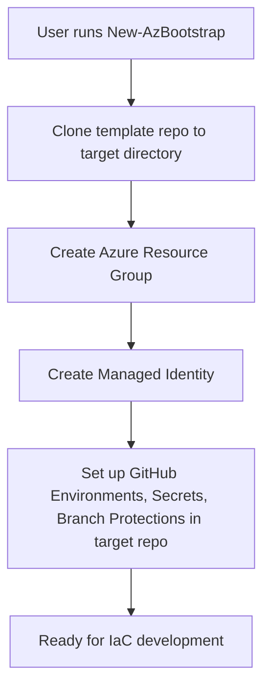

# az-bootstrap

A PowerShell module to bootstrap Azure infrastructure and GitHub repository environments for Infrastructure-as-Code (IaC) projects.

## What does it do?

- Clones a starter template repository from GitHub (the "source" template repo)
- Creates an Azure resource group and managed identity
- Sets up federated credentials for GitHub environments
- Configures GitHub environments, secrets, and branch protection in the new solution repository (the "target" repo)
- Grants Contributor and User Access Administrator (RBAC) roles to the managed identity at the resource group level

## How it Works

1. You use this module on your local machine (after installing and authenticating with Azure CLI and GitHub CLI).
2. The module clones a GitHub template repository (e.g., [terraform-azure-starter-template](https://github.com/kewalaka/terraform-azure-starter-template)) into a new directory for your solution repository.
3. It provisions the required Azure infrastructure (resource group, managed identity).
4. It configures the new solution repository with GitHub environments, secrets, and branch protections for secure OIDC-based deployments.

### Workflow Diagram



## Prerequisites

- PowerShell 7+
- Azure CLI (`az`)
- GitHub CLI (`gh`)
- You must be logged in to both Azure and GitHub CLIs before running the module (non-interactive usage)
- Permissions to create Azure resources and GitHub repositories

## Usage Example

```powershell
Import-Module ./az-bootstrap.psd1 -Force

# Example assuming you want the new repo 'my-new-iac-project' created under your user account
New-AzBootstrap `
  -TemplateRepoUrl "https://github.com/kewalaka/terraform-azure-starter-template" `
  -TargetRepoName "my-new-iac-project" ` # Added missing mandatory parameter
  -TargetDirectory "./my-new-iac-project-local" `
  -PlanEnvName "plan" `
  -ApplyEnvName "apply" `
  -ResourceGroupName "rg-my-new-iac-project" `
  -Location "australiaeast" `
  -ManagedIdentityName "mi-my-new-iac-project" `
  -ArmTenantId "YOUR_AZURE_TENANT_ID" ` # Required if not set as env var $env:ARM_TENANT_ID
  -ArmSubscriptionId "YOUR_AZURE_SUBSCRIPTION_ID" # Required if not set as env var $env:ARM_SUBSCRIPTION_ID
  # -Owner "YourGitHubOrg" # Optional: Specify if creating under an organization
  # -ApplyEnvironmentReviewers @("githubuser1", "team-alias") # Optional: Defaults to no reviewers
  # -ProtectedBranchName "develop" # Optional: Defaults to "main"
  # -RequirePR $false # Optional: Defaults to $true
  # -RequiredReviewers 0 # Optional: Defaults to 1
```

- The command above will clone the template repo, create the Azure infra, and configure the new solution repo for secure OIDC-based deployments.
- You need to provide Azure Tenant and Subscription IDs either via parameters (`-ArmTenantId`, `-ArmSubscriptionId`) or environment variables (`$env:ARM_TENANT_ID`, `$env:ARM_SUBSCRIPTION_ID`). The Managed Identity Client ID (`ARM_CLIENT_ID`) is automatically determined and configured.

## Next Steps

- See [DESIGN.md](./DESIGN.md) for more details on architecture and extensibility.
- See the `tests/` folder for usage examples and Pester tests.
